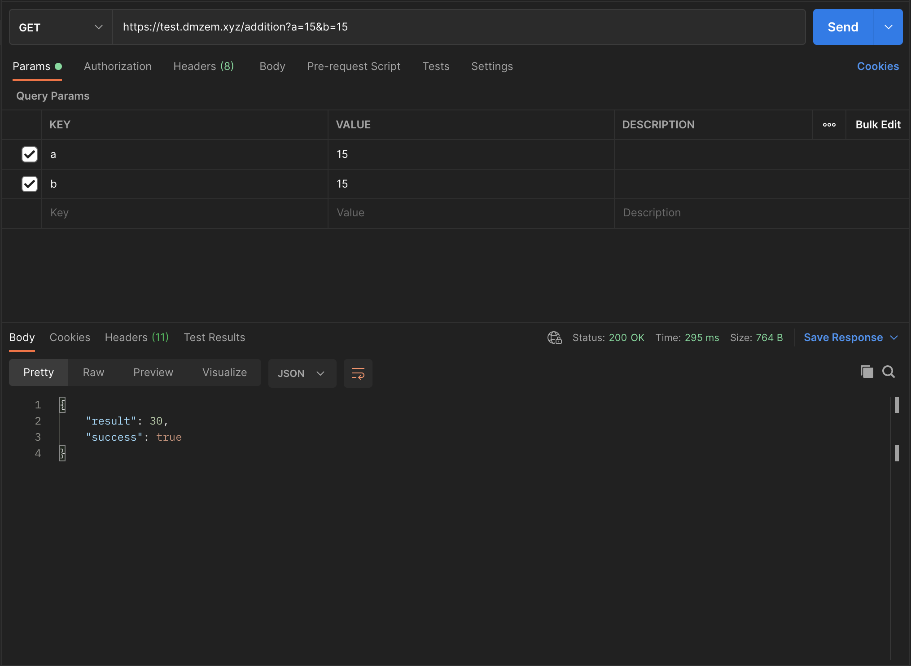
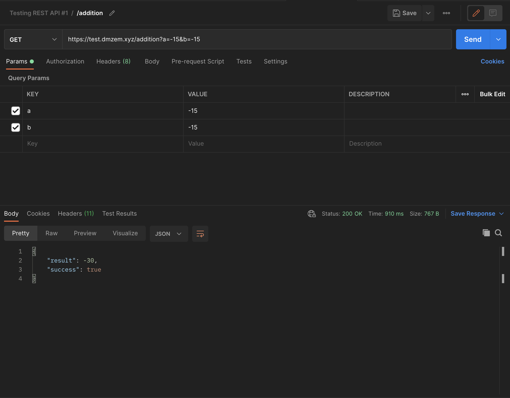
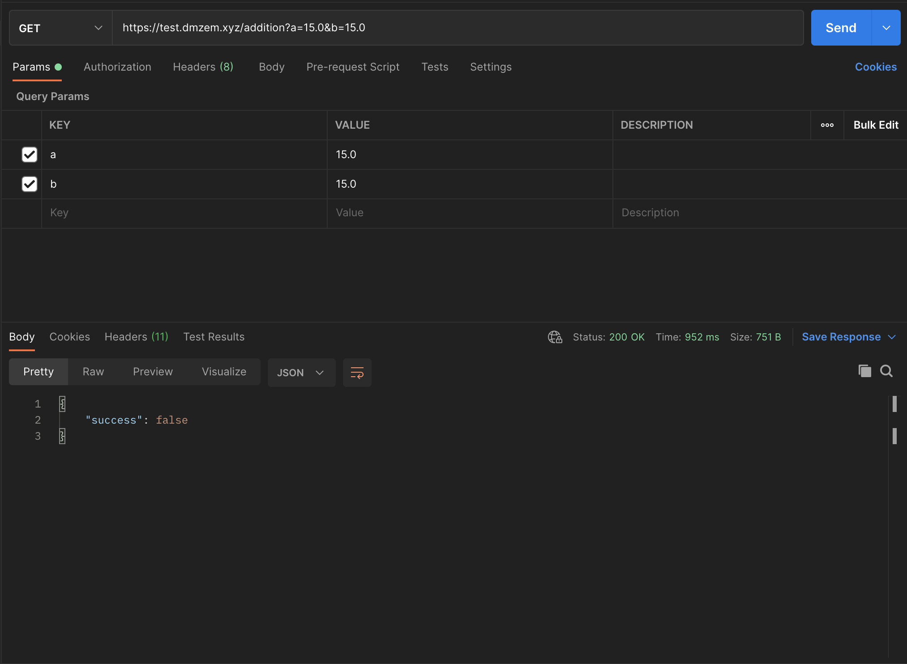
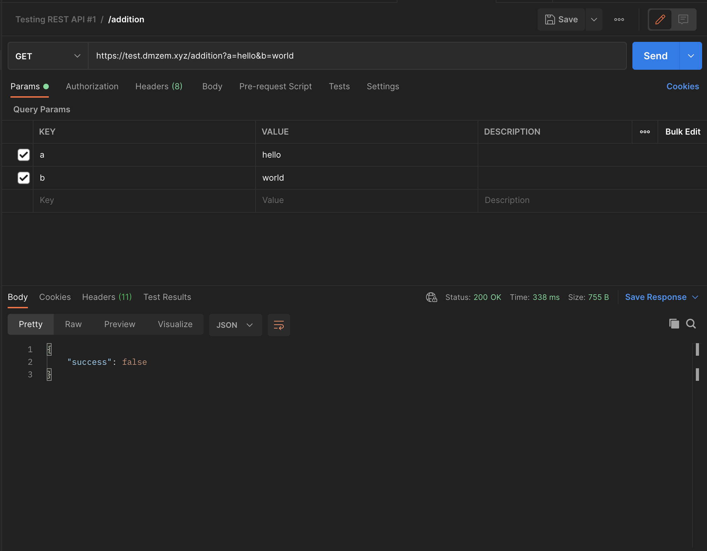
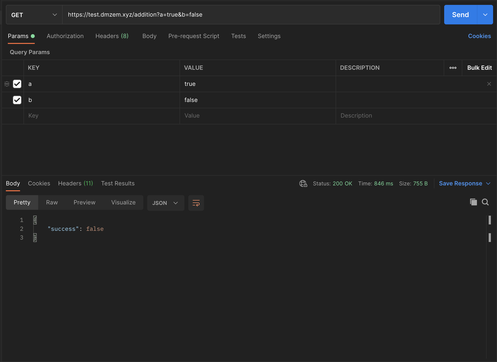
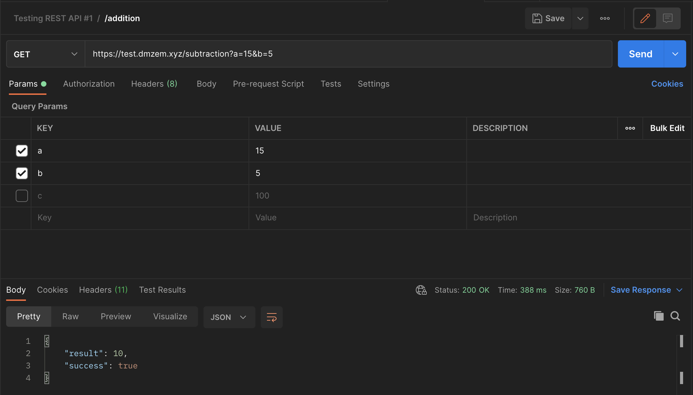
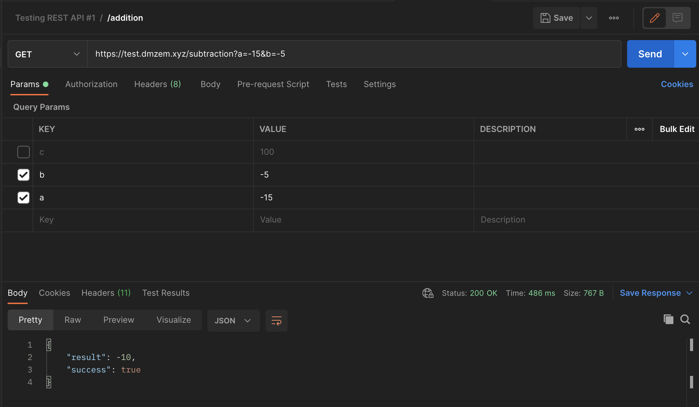
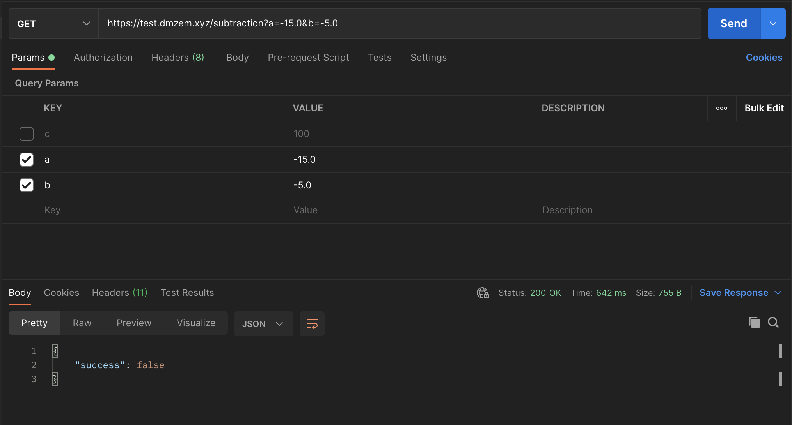

# Testing REST API

## Intro

Main url: [https://test.dmzem.xyz/](https://test.dmzem.xyz/)

Search for **[UNEXPECTED BEHAVIOUR]** through file to find errors

## Addition

### Endpoint
> [GET] [https://test.dmzem.xyz/addition](https://test.dmzem.xyz/addition)

### Parameters
> a \
> b

### Steps
1. Try adding positive integer numbers
    - Awaiting: sum of two integers
    - Fact: sum of two integers
    
2. Try adding negative integer numbers
    - Awaiting: sum of two integers
    - Fact: sum of two integers
    
2. Try adding floating point numbers
    - Awaiting: sum of two floating point numbers
    - Fact: **[UNEXPECTED BEHAVIOUR]** "success": false
    
3. Try adding characters
    - Awaiting: "success": false
    - Fact: "success": false
    
4. Try adding boolean values
    - Awaiting: "success": false
    - Fact: "success": false
    

## Substraction

### Endpoint
> [GET] [https://test.dmzem.xyz/subtraction](https://test.dmzem.xyz/subtraction)

### Parameters
> a \
> b

### Steps
1. Try subtract two positive integers
    - Awaiting: result of subtraction of two integers
    - Fact: result of subtraction of two integers
    
2. Try subtract two negative integers
    - Awaiting: result of subtraction of two negative integers
    - Fact: result of subtraction of two negative integers
    
3. Try subtract two floating point numbers
    - Awaiting: result of subtraction of two floating point numbers
    - Fact: **[UNEXPECTED BEHAVIOUR]** "success": false
    
